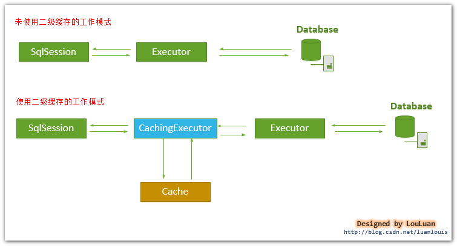

# **深入理解MyBatis原理**

## **一、MyBatis初始化机制**
MyBatis的初始化，就是加载配置信息。MyBatis的配置信息的层级结构如下：
```
configuration配置
|---properties属性
|---settings设置
|---typeAliases类型命名
|---typeHandlers类型处理器
|---objectFactory对象工厂
|---plugins插件
|---environments环境
|   |---environment环境变量
|   |---transactionManager事务管理器
|   |---dataSource数据源
mapper映射器
```
MyBatis采用`org.apache.ibatis.session.Configuration`对象作为配置所有配置信息的容器，这个对象的结构和XML文件的结构非常相似。可以说，MyBatis的初始化过程，实际上就是创建Configuration对象的过程。

MyBatis中的Configuration对象的创建有两种方式：第一种是通过XML方式配置Configuration对象，然后在Java代码中直接获取到这个对象；第二种是直接通过Java对象，手动创建Configuration对象。这里主要讲解第一种方法的创建过程。

MyBatis初始化的代码如下：
```java
String resource = "mybatis-config.xml";
InputStream inputStream = Resources.getResourceAsStream(resource);
SqlSessionFactory sqlSessionFactory = new SqlSessionFactoryBuilder().build(inputStream);
SqlSession sqlSession = sqlSessionFactory.openSession();
List list = sqlSession.selectList("my.itg.ssm.mapper.UserMapper.queryAllUsers");
```
第三行中创建SqlSessionFactory的底层代码逻辑分以下几步：<br/>
（1）根据传入的InputStream，创建一个XMLConfigBuilder对象；<br/>
（2）XMLConfigBuilder对象调用parse()方法，返回Configuration对象；<br/>
（2）根据Configuration对象创建一个DefaultSessionFactory对象并返回。

创建Configuration对象的过程分以下几步：<br/>
（1）XMLConfigBuilder对象将XML配置文件的信息转换为Document对象；<br/>
（2）XMLConfigBuilder对象将DTD文件的信息转换成XMLMapperEntityResolver对象；<br/>
（3）将Document对象和XMLMapperEntityResolver对象封装到XpathParser对象中；<br/>
（4）XMLConfigBuilder对象调用parseConfiguration()方法，从XpathParser中取出\<configuration\>节点对应的Node对象，然后解析此Node节点中的properties、mappers等子节点；<br/>
（5）将解析出来的数据都存储到Configuration对象中并返回。

## **二、MyBatis的一级缓存**
在对数据库的一次会话中，我们有可能会反复地执行完全相同的查询语句，如果不采取一些措施的话，每一次查询都会查询一次数据库，而我们在极短的时间内做了完全相同的查询，那么它们的结果极有可能完全相同，由于查询以此数据库的代价很大，有可能会造成很大的资源浪费。

为了解决这一问题，MyBatis在SqlSession中建立了一个本地缓存，对于每一次查询，都会尝试根据查询的条件去本地缓存中查找是否存在缓存，如果在缓存中，则直接从缓存中取出返回给用户；否则，从数据库中读取数据，将查询结果存入缓存并返回给用户。

`SqlSession`是一个接口，MyBatis中使用的是它的实现类`DefaultSqlSession`。DefaultSqlSession中维护了一个`Executor`执行器接口，其普遍实现是`BaseExecutor`类。BaseExecutor中维护了一个`PerpetualCache`类，这是一个实现了`Cache`接口的类。MyBatis的一级缓存就是存放在这个`PerpetualCache`类中，这个类实现了Cache接口中的`putObject()`、`getObject()`、`removeObject()`等方法，通过向一个HashMap中存取键值对来实现一个简单的缓存。

当创建SqlSession时，会同时创建出PerpetualCache，一级缓存的生命周期开始；当SqlSession调用了`close()`方法时，会释放掉一级缓存，一级缓存将不再可用；当SqlSession调用了`clearCache()`方法时，会清空一级缓存中的数据，但一级缓存对象仍可用；每当SqlSession执行了以此update、insert或delete操作后，都会清空一级缓存，但一级缓存对象仍可用。

一级缓存是使用HashMap来实现的，其中的value是本次查询出来的结果，而key是由多方面因素决定的：<br/>
（1）mybatis产生的statementId是否相同；<br/>
（2）一些查询条件，如分页条件limit、where语句中的参数名及其值等是否相同；<br/>
（3）由JDBC转化成的SQL语句是否相同。

MyBatis的一级缓存是存在一定的性能缺陷的：<br/>
（1）MyBatis对一级缓存的设计比较简单，就是简单的使用了HashMap，对于HashMap的容量和大小没有进行限制；<br/>
（2）一级缓存是一个粗粒度的缓存，没有更新缓存和缓存过期的概念。

## **三、MyBatis的二级缓存**
MyBatis的二级缓存是Application级别的缓存，它可以提高对数据库查询的效率，以提高应用的性能。

MyBatis的二级缓存默认是不开启的，只有在\<settings\>配置中配置`cacheEnabled=true`才能开启。开启二级缓存后，MyBatis将不再使用DefaultExecutor，而是使用CachingExecutor；在使用时，会先判断二级缓存中是否有缓存，如果有则返回结果，否则交给Executor去完成查询操作（Executor中有一级缓存），然后存入缓存，并返回给用户。使用二级缓存前后的查询流程对比如下图：<br/>


MyBatis的二级缓存还可以对缓存进行划分，即可以为一个Mapper配置一个cache对象，也可以为多个Mapper设置一个公用的cache对象。

如果要为一个Mapper配置一个cache对象，需要在Mapper的XML文件中添加如下代码：
```xml
<cache type = "PERPETUAL" eviction = "LRU" flushInterval = "60000"
    size = "512" readOnly = "false" blocking = "false" />
<!--
    type：缓存类型，默认是一级缓存的模式（Perpetual）
    eviction：回收策略，常见的有FIFO、LRU等
    flushInterval：自动刷新缓存的时间间隔
    size：最多缓存的对象个数
    readOnly：是否制度，如果为true，则需要对应的实体类能够序列化
    blocking：如果缓存中找不到对应的key，是否会一直阻塞，直到有对应的数据进入缓存
-->
```

如果要为多个Mapper配置一个cache，则需要在某个Mapper中配置\<cache\>后，其它Mapper中添加如下代码：
```xml
<cache-ref namespace="mapper.UserMapper"/>
<!-- namespace中写的是配置了<cache>标签的Mapper的路径 -->
```

MyBatis对二级缓存的支持粒度很细，它可以指定某一条查询语句是否使用缓存：
```xml
<select id="selectUserById" resultType="User" parameterType="int" useCache="true">
```
这样做需要有几个前提：第一，确保MyBatis支持二级缓存的总开关`cacheEnabled`设置为true；第二，该select语句所在的Mapper配置了\<cache\>或\<cache-ref\>节点，并且有效；第三，该select语句中设置了`useCache`为true。

MyBatis默认为我们提供了两种缓存的实现：FIFO和LRU：<br/>
（1）LRU算法：最近最少使用算法，即如果缓存中容量已满，会将缓存中最近最少使用的缓存记录清除；<br/>
（2）FIFO算法：先进先出算法，如果缓存中的容量已满，则将最先进入缓存的数据清除。